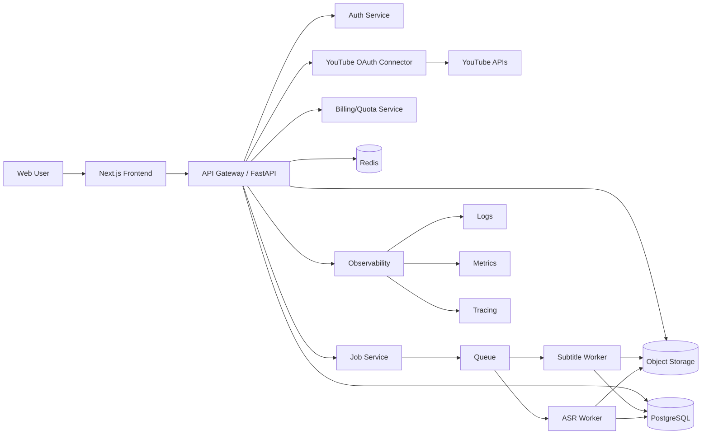

# V2 Architecture + Database + API Contract Draft

## 1. Architecture Diagram (Mermaid)


## 2. Database Schema (PostgreSQL DDL)
```sql
CREATE EXTENSION IF NOT EXISTS "pgcrypto";

CREATE TYPE job_source_type AS ENUM ('youtube_oauth', 'upload');
CREATE TYPE job_status AS ENUM ('queued', 'running', 'success', 'failed', 'retrying', 'canceled');
CREATE TYPE export_format AS ENUM ('txt', 'srt', 'vtt');
CREATE TYPE subscription_status AS ENUM ('trialing', 'active', 'past_due', 'canceled');
CREATE TYPE transcript_edit_status AS ENUM ('draft', 'published');

CREATE TABLE users (
  id UUID PRIMARY KEY DEFAULT gen_random_uuid(),
  email TEXT UNIQUE NOT NULL,
  password_hash TEXT NOT NULL,
  display_name TEXT,
  locale TEXT DEFAULT 'en-US',
  created_at TIMESTAMPTZ NOT NULL DEFAULT now(),
  updated_at TIMESTAMPTZ NOT NULL DEFAULT now()
);

CREATE TABLE workspaces (
  id UUID PRIMARY KEY DEFAULT gen_random_uuid(),
  name TEXT NOT NULL,
  owner_user_id UUID NOT NULL REFERENCES users(id),
  created_at TIMESTAMPTZ NOT NULL DEFAULT now()
);

CREATE TABLE workspace_memberships (
  workspace_id UUID NOT NULL REFERENCES workspaces(id) ON DELETE CASCADE,
  user_id UUID NOT NULL REFERENCES users(id) ON DELETE CASCADE,
  role TEXT NOT NULL CHECK (role IN ('owner', 'admin', 'editor', 'viewer')),
  created_at TIMESTAMPTZ NOT NULL DEFAULT now(),
  PRIMARY KEY (workspace_id, user_id)
);

CREATE TABLE youtube_oauth_connections (
  id UUID PRIMARY KEY DEFAULT gen_random_uuid(),
  workspace_id UUID NOT NULL REFERENCES workspaces(id) ON DELETE CASCADE,
  google_account_email TEXT NOT NULL,
  encrypted_access_token TEXT NOT NULL,
  encrypted_refresh_token TEXT NOT NULL,
  scopes TEXT[] NOT NULL,
  token_expires_at TIMESTAMPTZ,
  created_at TIMESTAMPTZ NOT NULL DEFAULT now(),
  updated_at TIMESTAMPTZ NOT NULL DEFAULT now()
);

CREATE TABLE projects (
  id UUID PRIMARY KEY DEFAULT gen_random_uuid(),
  workspace_id UUID NOT NULL REFERENCES workspaces(id) ON DELETE CASCADE,
  name TEXT NOT NULL,
  description TEXT,
  created_by UUID NOT NULL REFERENCES users(id),
  created_at TIMESTAMPTZ NOT NULL DEFAULT now()
);

CREATE TABLE source_assets (
  id UUID PRIMARY KEY DEFAULT gen_random_uuid(),
  workspace_id UUID NOT NULL REFERENCES workspaces(id) ON DELETE CASCADE,
  project_id UUID REFERENCES projects(id) ON DELETE SET NULL,
  source_type job_source_type NOT NULL,
  youtube_video_id TEXT,
  youtube_url TEXT,
  upload_object_key TEXT,
  upload_filename TEXT,
  media_duration_seconds INTEGER,
  metadata JSONB NOT NULL DEFAULT '{}'::jsonb,
  created_at TIMESTAMPTZ NOT NULL DEFAULT now()
);

CREATE TABLE jobs (
  id UUID PRIMARY KEY DEFAULT gen_random_uuid(),
  workspace_id UUID NOT NULL REFERENCES workspaces(id) ON DELETE CASCADE,
  project_id UUID REFERENCES projects(id) ON DELETE SET NULL,
  source_asset_id UUID NOT NULL REFERENCES source_assets(id) ON DELETE CASCADE,
  source_type job_source_type NOT NULL,
  status job_status NOT NULL DEFAULT 'queued',
  language_pref TEXT NOT NULL DEFAULT 'auto',
  with_timestamps BOOLEAN NOT NULL DEFAULT true,
  progress SMALLINT NOT NULL DEFAULT 0 CHECK (progress >= 0 AND progress <= 100),
  error_code TEXT,
  error_message TEXT,
  engine TEXT,
  started_at TIMESTAMPTZ,
  finished_at TIMESTAMPTZ,
  created_by UUID NOT NULL REFERENCES users(id),
  created_at TIMESTAMPTZ NOT NULL DEFAULT now()
);
CREATE INDEX idx_jobs_workspace_created_at ON jobs(workspace_id, created_at DESC);
CREATE INDEX idx_jobs_status ON jobs(status);

CREATE TABLE transcripts (
  id UUID PRIMARY KEY DEFAULT gen_random_uuid(),
  job_id UUID UNIQUE NOT NULL REFERENCES jobs(id) ON DELETE CASCADE,
  language TEXT,
  source_label TEXT,
  raw_text TEXT NOT NULL,
  created_at TIMESTAMPTZ NOT NULL DEFAULT now()
);

CREATE TABLE transcript_segments (
  id UUID PRIMARY KEY DEFAULT gen_random_uuid(),
  transcript_id UUID NOT NULL REFERENCES transcripts(id) ON DELETE CASCADE,
  segment_index INTEGER NOT NULL,
  start_seconds NUMERIC(10,3) NOT NULL,
  end_seconds NUMERIC(10,3) NOT NULL,
  text TEXT NOT NULL,
  UNIQUE (transcript_id, segment_index)
);

CREATE TABLE transcript_versions (
  id UUID PRIMARY KEY DEFAULT gen_random_uuid(),
  transcript_id UUID NOT NULL REFERENCES transcripts(id) ON DELETE CASCADE,
  version_number INTEGER NOT NULL,
  edit_status transcript_edit_status NOT NULL DEFAULT 'draft',
  edited_text TEXT NOT NULL,
  editor_user_id UUID NOT NULL REFERENCES users(id),
  created_at TIMESTAMPTZ NOT NULL DEFAULT now(),
  UNIQUE (transcript_id, version_number)
);

CREATE TABLE exports (
  id UUID PRIMARY KEY DEFAULT gen_random_uuid(),
  workspace_id UUID NOT NULL REFERENCES workspaces(id) ON DELETE CASCADE,
  transcript_version_id UUID NOT NULL REFERENCES transcript_versions(id) ON DELETE CASCADE,
  format export_format NOT NULL,
  object_key TEXT NOT NULL,
  file_size_bytes BIGINT,
  created_by UUID NOT NULL REFERENCES users(id),
  created_at TIMESTAMPTZ NOT NULL DEFAULT now()
);

CREATE TABLE plans (
  id UUID PRIMARY KEY DEFAULT gen_random_uuid(),
  code TEXT UNIQUE NOT NULL,
  name TEXT NOT NULL,
  monthly_minutes INTEGER NOT NULL,
  max_file_size_mb INTEGER NOT NULL,
  created_at TIMESTAMPTZ NOT NULL DEFAULT now()
);

CREATE TABLE subscriptions (
  id UUID PRIMARY KEY DEFAULT gen_random_uuid(),
  workspace_id UUID UNIQUE NOT NULL REFERENCES workspaces(id) ON DELETE CASCADE,
  plan_id UUID NOT NULL REFERENCES plans(id),
  status subscription_status NOT NULL,
  period_start TIMESTAMPTZ NOT NULL,
  period_end TIMESTAMPTZ NOT NULL,
  created_at TIMESTAMPTZ NOT NULL DEFAULT now(),
  updated_at TIMESTAMPTZ NOT NULL DEFAULT now()
);

CREATE TABLE usage_ledger (
  id UUID PRIMARY KEY DEFAULT gen_random_uuid(),
  workspace_id UUID NOT NULL REFERENCES workspaces(id) ON DELETE CASCADE,
  job_id UUID REFERENCES jobs(id) ON DELETE SET NULL,
  usage_minutes NUMERIC(10,3) NOT NULL,
  usage_type TEXT NOT NULL CHECK (usage_type IN ('transcription', 'subtitle_extraction', 'export')),
  created_at TIMESTAMPTZ NOT NULL DEFAULT now()
);
CREATE INDEX idx_usage_ledger_workspace_created_at ON usage_ledger(workspace_id, created_at DESC);

CREATE TABLE audit_logs (
  id UUID PRIMARY KEY DEFAULT gen_random_uuid(),
  workspace_id UUID REFERENCES workspaces(id) ON DELETE SET NULL,
  actor_user_id UUID REFERENCES users(id) ON DELETE SET NULL,
  action TEXT NOT NULL,
  target_type TEXT NOT NULL,
  target_id TEXT,
  details JSONB NOT NULL DEFAULT '{}'::jsonb,
  created_at TIMESTAMPTZ NOT NULL DEFAULT now()
);

CREATE TABLE abuse_reports (
  id UUID PRIMARY KEY DEFAULT gen_random_uuid(),
  workspace_id UUID REFERENCES workspaces(id) ON DELETE SET NULL,
  reporter_email TEXT,
  job_id UUID REFERENCES jobs(id) ON DELETE SET NULL,
  report_type TEXT NOT NULL CHECK (report_type IN ('copyright', 'privacy', 'illegal', 'other')),
  description TEXT NOT NULL,
  status TEXT NOT NULL DEFAULT 'open' CHECK (status IN ('open', 'reviewing', 'resolved', 'rejected')),
  created_at TIMESTAMPTZ NOT NULL DEFAULT now(),
  resolved_at TIMESTAMPTZ
);
```

## 3. API Contract Scope (OpenAPI Draft)
- Spec file: `docs/openapi-v2-draft.yaml`
- Coverage in draft:
1. Auth and workspace bootstrap
2. YouTube OAuth connect/callback
3. Upload init/complete
4. Job create/list/get/retry/cancel
5. Transcript get/update/version publish
6. Export create/download
7. Usage summary
8. Abuse report submit/list

